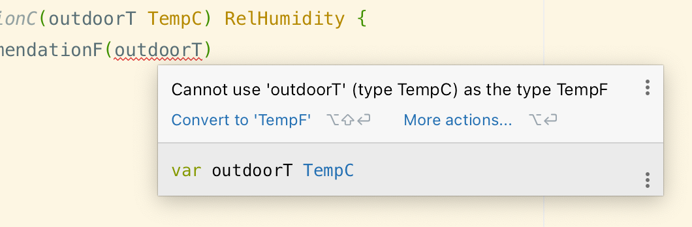

# `github.com/cdzombak/libwx`

[](https://pkg.go.dev/github.com/cdzombak/libwx)

This package primarily provides some weather/atmospheric-related calculations. It also provides types for these calculations to traffic, helping to reduce the chance of mixing up units.

For example, these types prevent accidentally using a Celsius temperature as a Fahrenheit temperature:



**Documentation:** [pkg.go.dev/github.com/cdzombak/libwx](https://pkg.go.dev/github.com/cdzombak/libwx)

## Installation

```shell
go get github.com/cdzombak/libwx
```

## Usage

### Dew point calculation

[`DewPointF()`](https://pkg.go.dev/github.com/cdzombak/libwx#DewPointF) and [`DewPointC()`](https://pkg.go.dev/github.com/cdzombak/libwx#DewPointC) calculate the dew point, given a temperature and relative humidity.

### Indoor humidity recommendation

[`IndoorHumidityRecommendationF()`](https://pkg.go.dev/github.com/cdzombak/libwx#IndoorHumidityRecommendationF) and [`IndoorHumidityRecommendationC()`](https://pkg.go.dev/github.com/cdzombak/libwx#IndoorHumidityRecommendationC) provide a recommended maximum *indoor* humidity percentage for the given *outdoor* temperature.

### Wind chill calculation

[`WindChillF()`](https://pkg.go.dev/github.com/cdzombak/libwx#WindChillF) and [`WindChillC()`](https://pkg.go.dev/github.com/cdzombak/libwx#WindChillC) calculate the wind chill, given the outdoor temperature and wind speed.

The wind chill formula works given temperatures less than 50ºF and wind speeds greater than 3 mph. To calculate wind chill but return an error if the input is outside this range, use [`WindChillFWithValidation()`](https://pkg.go.dev/github.com/cdzombak/libwx#WindChillFWithValidation) and [`WindChillCWithValidation()`](https://pkg.go.dev/github.com/cdzombak/libwx#WindChillCWithValidation). These functions return [`ErrInputRange`](https://pkg.go.dev/github.com/cdzombak/libwx#ErrInputRange) if the input is out of the formula's input range.

### Wet bulb temperature calculation

[`WetBulbF()`](https://pkg.go.dev/github.com/cdzombak/libwx#WetBulbF) and [`WetBulbC()`](https://pkg.go.dev/github.com/cdzombak/libwx#WetBulbC) calculate the [wet bulb temperature](https://en.wikipedia.org/wiki/Wet-bulb_temperature), given the dry bulb temperature and relative humidity.

This formula is taken from ["Wet-Bulb Temperature from Relative Humidity and Air Temperature" (Roland Stull, Journal of Applied Meteorology and Climatology, 2011)](https://journals.ametsoc.org/view/journals/apme/50/11/jamc-d-11-0143.1.xml) and assumes standard sea level pressure.

These functions return [`ErrInputRange`](https://pkg.go.dev/github.com/cdzombak/libwx#ErrInputRange) if the input is out of the formula's input range.

### Heat index calculation

[`HeatIndexF()`](https://pkg.go.dev/github.com/cdzombak/libwx#HeatIndexF) and [`HeatIndexC()`](https://pkg.go.dev/github.com/cdzombak/libwx#HeatIndexC) calculate the [heat index](https://en.wikipedia.org/wiki/Heat_index), given a temperature and relative humidity.

#### Heat index warning levels

[`HeatIndexWarningF()`](https://pkg.go.dev/github.com/cdzombak/libwx#HeatIndexWarningF) and [`HeatIndexWarningC()`](https://pkg.go.dev/github.com/cdzombak/libwx#HeatIndexWarningC) provide a warning level based on the heat index. These warning levels are based on the NOAA's heat index table:

```go
HeatIndexWarningNone
HeatIndexWarningCaution
HeatIndexWarningExtremeCaution
HeatIndexWarningDanger
HeatIndexWarningExtremeDanger
```

### Distance types & conversions

The following distance types are provided:

- [`Mile`](https://pkg.go.dev/github.com/cdzombak/libwx#Mile)
- [`Meter`](https://pkg.go.dev/github.com/cdzombak/libwx#Meter)
- [`Km`](https://pkg.go.dev/github.com/cdzombak/libwx#Km) (kilometer)
- [`NauticalMile`](https://pkg.go.dev/github.com/cdzombak/libwx#NauticalMile)

Each type provides methods to convert to the other types (e.g. [`NauticalMile.Meters()`](https://pkg.go.dev/github.com/cdzombak/libwx#NauticalMile.Meters)). An [`Unwrap()`](https://pkg.go.dev/github.com/cdzombak/libwx#NauticalMile.Unwrap) method also exists to get the raw value as a `float64`.

### Humidity type

The [`RelHumidity`](https://pkg.go.dev/github.com/cdzombak/libwx#RelHumidity) type is an integer type representing a relative humidity percentage from `0-100`, inclusive. A clamping [method](https://pkg.go.dev/github.com/cdzombak/libwx#RelHumidity.Clamped) and [function](https://pkg.go.dev/github.com/cdzombak/libwx#ClampedRelHumidity) for this range are provided.

An [`Unwrap()`](https://pkg.go.dev/github.com/cdzombak/libwx#RelHumidity.Unwrap) method also exists to get the raw value as an `int`; [`UnwrapFloat64()`](https://pkg.go.dev/github.com/cdzombak/libwx#RelHumidity.UnwrapFloat64) returns the value as a `float64`.

### Pressure types and conversions

The following pressure types are provided:

- [`PressureInHg`](https://pkg.go.dev/github.com/cdzombak/libwx#PressureInHg) (inches of mercury)
- [`PressureMb`](https://pkg.go.dev/github.com/cdzombak/libwx#PressureMb) (millibars)

Each type provides methods to convert to the other type (e.g. [`PressureInHg.Mb()`](https://pkg.go.dev/github.com/cdzombak/libwx#PressureInHg.Mb)). An [`Unwrap()`](https://pkg.go.dev/github.com/cdzombak/libwx#PressureInHg.Unwrap) method also exists to get the raw value as a `float64`.

### Speed types and conversions

The following speed types are provided:

- [`SpeedMph`](https://pkg.go.dev/github.com/cdzombak/libwx#SpeedMph) (miles per hour)
- [`SpeedKmh`](https://pkg.go.dev/github.com/cdzombak/libwx#SpeedKmh) (kilometers per hour)
- [`SpeedKnots`](https://pkg.go.dev/github.com/cdzombak/libwx#SpeedKnots) (knots)

Each type provides methods to convert to the other types (e.g. [`SpeedKnots.Mph()`](https://pkg.go.dev/github.com/cdzombak/libwx#SpeedKnots.Mph)). An [`Unwrap()`](https://pkg.go.dev/github.com/cdzombak/libwx#SpeedKnots.Unwrap) method also exists to get the raw value as a `float64`.

### Temperature types and conversions

The following temperature types are provided:

- [`TempF`](https://pkg.go.dev/github.com/cdzombak/libwx#TempF) (Fahrenheit)
- [`TempC`](https://pkg.go.dev/github.com/cdzombak/libwx#TempC) (Celsius)

Each type provides methods to convert to the other type (e.g. [`TempF.C()`](https://pkg.go.dev/github.com/cdzombak/libwx#TempF.C)). An [`Unwrap()`](https://pkg.go.dev/github.com/cdzombak/libwx#TempF.Unwrap) method also exists to get the raw value as a `float64`.

### Utilities: Comparisons

Finally, `libwx` provides some utility functions for comparing `float64` and `int` values:

- [`IntCompare(a, b int) int`](https://pkg.go.dev/github.com/cdzombak/libwx#IntCompare)
- [`Float64Compare(a, b, tolerance float64) int`](https://pkg.go.dev/github.com/cdzombak/libwx#Float64Compare)
- [`Float64Equal(a, b, tolerance float64) bool`](https://pkg.go.dev/github.com/cdzombak/libwx#Float64Equal)

The `*Compare(…)` functions return:

- `-1` if `a < b`
- `0` if `a == b`
- `1` if `a > b`

For `float64` comparisons functions that accept a `tolerance`, convenience tolerance [constants](https://pkg.go.dev/github.com/cdzombak/libwx#pkg-constants) are provided:

```go
ToleranceExact = float64(0.0)
Tolerance0     = float64(1.0)
Tolerance1      = float64(0.1)
Tolerance01    = float64(0.01)
Tolerance001   = float64(0.001)
```

#### Curried `float64` comparisons

When making repeated comparisons with the same tolerance, having to pass the tolerance each time is tedious and increases room for human error. To help with this, curried versions of `Float64Compare()` and `Float64Equal()` are provided. These return a comparison function with the specified tolerance baked-in:

- [`CurriedFloat64Compare(tolerance float64) func(float64, float64) int`](https://pkg.go.dev/github.com/cdzombak/libwx#CurriedFloat64Compare)
- [`CurriedFloat64Equal(tolerance float64) func(float64, float64) bool`](https://pkg.go.dev/github.com/cdzombak/libwx#CurriedFloat64Equal)

For example:

```go
package main

import (
	wx "github.com/cdzombak/libwx"
)

function main() {
	equalityChecker := wx.CurriedFloat64Equal(Tolerance1)

	equalityChecker(1.0, 1.11) // => false
	equalityChecker(1.0, 1.01) // => true
}
```

## License

MIT; see [LICENSE](LICENSE) in this repo.

## Author

Chris Dzombak
- [dzombak.com](https://dzombak.com)
- [github @cdzombak](https://github.com/cdzombak)
